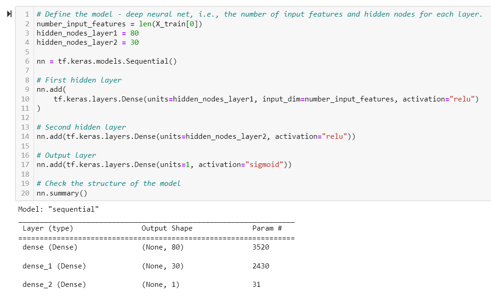
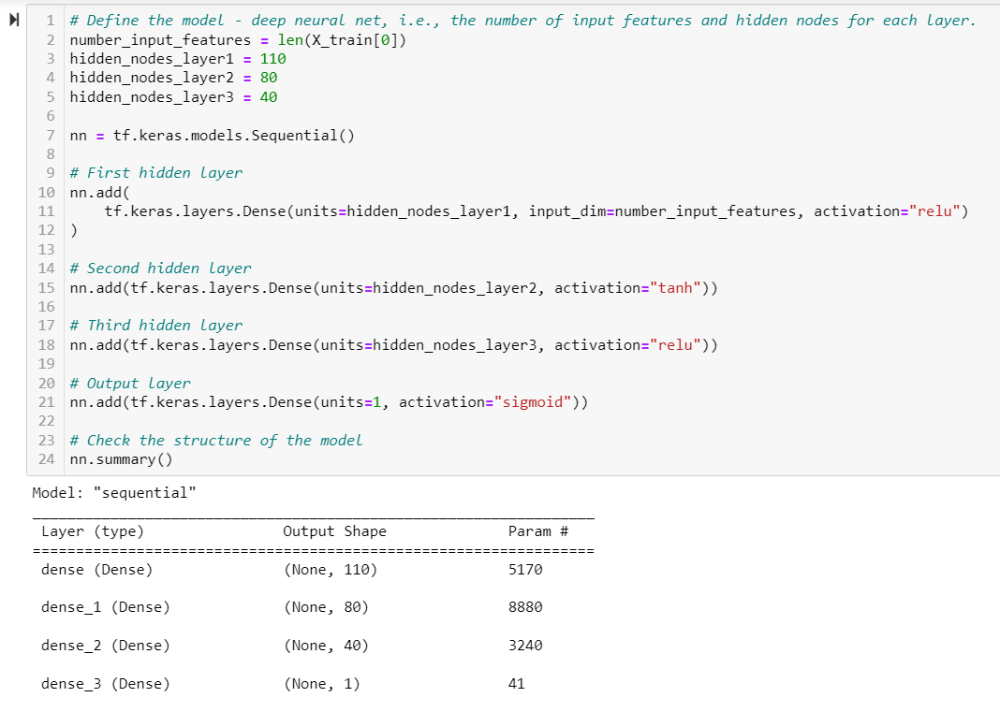
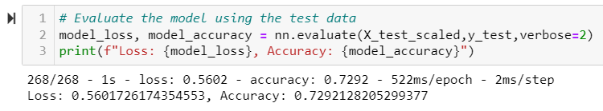
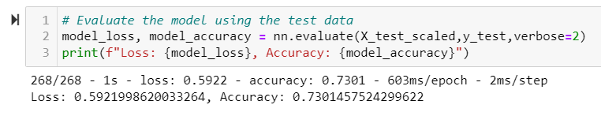
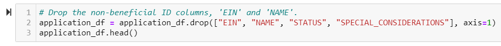
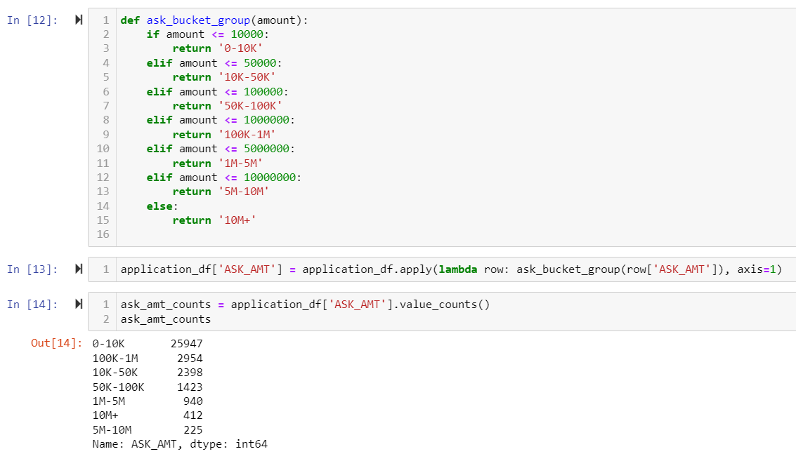

# Neural_Network_Charity_Analysis

## Overview
We are creating a binary classifier that is capable of predicting whether applicants will be successful if funded by Alphabet Soup. Using machine learning and neural networks we are going to preprocess the data, as well as compile, train, and evaluate the model. We will then try to optimize our model with a goal of 75% accuracy.

## Results

### Data Processing

- What variable(s) were considered the target?

  The “IS_SUCCESSFUL” variable was the target for the model.

- What variable(s) were considered the features?

  For the original model we considered “APPLICATION_TYPE”, “AFFILIATION”, “CLASSIFICATION”, “USE_CASE”, “ORGANIZATION”, “STATUS”, “INCOME_AMT”, “SPECIAL_CONSIDERATIONS”, “ASK_AMT” all features. For the optimized model I removed “STATUS” and “SPECIAL_CONSIDERATIONS” from the features.

- What variable(s) were considered neither and removed?
  For the original model we removed “EIN” and “NAME”. For the optimized model I removed both “EIN” and “NAME” but also “STATUS” and “SPECIAL_CONSIDERATIONS”.

### Compiling, Training, and Evaluating the Model

- How many neurons, layers, and activation functions were selected for your neural network?

  The original model had us add 2 hidden layers using “relu” as the activation for both. The first hidden layer contains 80 neurons and the second contains 30. The hidden layers were followed by the output layer that used a sigmoid activation.

  

  For the optimized model I added an additional hidden layer making 3 hidden layers. I increased the neurons to 110 for the first, 80 for the second, followed by 40 for the third. The first and third layers used “relu” activation functions and the second hidden layer used “tahn”. The output layer remained the same as the original model.

  

- Was the model able to achieve the target model?
  I was not able to reach the target model performance of 75% accuracy for either model. The original model resulted in 72.9% accuracy and the optimized model resulted in 73.0% accuracy.

- What steps did you take to try and increase the model performance?
  As summarized through the results the changes made to try and optimize the model were:
  - Removing "STATUS", "SPECIAL_CONSIDERATIONS" columns as features
  - I bucketed the “ASK_AMOUNT” into groups in an attempt to address some of the extremely high asking amount outliers.
  - Added a 3rd hidden layer.
  - Increased the neurons of each hidden layer.
  - Changed the second layer's activation function to “tanh”.
  
  
  

## Summary

### Conclusion
The overall results of the original model brought in a 72.9% accuracy and after trying multiple optimizations we increased the model to only 73%, which means the model will predict whether the applicant will be successful if funded 73% of the time. As noted above this model did not reach our accuracy goal of 75%.

### Recommended Model
The recommended model to solve the classification problem we’re still seeing with the accuracy of our neural network could be the Random Forest classifier. This model will use the majority prediction from accessing many unrelated tree model predictions. Random Forest classifier will run faster, take less code to perform, and comes with a lower risk of overfitting the data.
